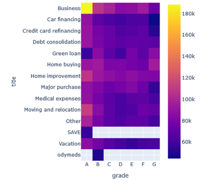

### Authors: [Adônis Dário](https://github.com/adonisdario), [Caio Guedes](https://github.com/caiocguedes), Eveline Cavalcanti e Fernando Rangel
# Cridit risk analysis using statistic methods

Let's explore how statistics concepts can be used to a real credit risk analysis.
Our study case will be a person named John, who is wanting a loan to fulfill his obligations.
Not only the analysis will apply to an individual, but also for the social group which he's in.

[Dataset used](https://www.kaggle.com/datasets/hetvigandhi03/loan-risk-analysis-dataset-real-world-data/discussion?sort=hotness).
[Code built](https://github.com/adonisdario/data-science/blob/main/credit-risk/Analise_de_Credito.ipynb)

## Introducing John's case

John is a young entrepreneur classified at group E, where low performance borrowers are ranked with a not attractive credit profile.
As we walk through John's information, we detect some interesting data for a rank E profile. So, why he's ranked so low?

1) He's a defaulter (**acc_now_delinq** > 0);
2) Although having a annual income of USD 95,000 his income could not be assured;
3) He has 35 open credit lines. Being a constant credit applicant means that he struggles finantially;
4) His loan objective is to pay a credit card debt, which is implies a lack of finantial control;
5) John pays rent.

Speaking of rent, 39% of the loan applicants currently pays rent, which is an alert to keep in mind when awarding credit to a phisics person. The probability of non-payment by a individual that pays rent increases because it is a constant expense on your income. Strike for John.

Looking deeply to the delinquent group, 36.8% of them applied for a loan to pay for the credit card debt. Applying for a loan to pay for a debt is a red flag. The applicant must have good warranties to get approved.

By the heatmap below we can analyse the distribution of the purpose of the loan for each rank. The collor tells the average annual income of each group and its purposes:

An extremely important matter of the credit concession is the credit maintenance, where we confirm which groups are interesting to conced credit loans, increase limits and which groups have to have recovery strategies, limit lowering or even exclusion of the credit lines. 
Why conced a credit line to John if 41.8% of the clients owns a house or are employed for at least 10 years? 
In fact, merging these two characteristics together we can create another rank A+ for 2.97% of the clients. These high ranked groups have a high annual income on average, like John's. However, unlike John people from high ranks have certified income. The probability of a client that's complient with its debts to apply for a loan that do not compromise its monthly income by 35%, is 89.4%.

To make thing even harder for John, by the chart below we see the probability of a client to have non complient lines of credit, using the **acc_now_delinq** column.

John have one non complient credit line, making him one of the 5% of the clients that have non complient credit lines. 
John should not have a new credit line, and here are some arguments thar reinforce this suggestion:

- Whithin credit analysis it is interesting to conced a loan to a client which has a maximum of 10 active lines of credit, depending on the rank of the client the maximum can be lower. The reason behind this is to mitigate the risk of non-complience by the client.

 

- Following a similar thought but analysing non-compliant accounts, at a certain point the loan amount is lowered significantly reinforcing the importance of kwnowing the risk-reward limit for a company to conced a loan, and justifies the raise of the interest rate.

## Group E

- By looking at rank E as a whole we can see the sampling distributions of annual income according to the group's profile. Raising afterwards the quantity of samples to monitor the behavior of the distribution we can see the floating of John's annual income of USD 95,000.

In conclusion, we suggest that the loan should not be conceded to John takeing into account that:

1) He's already non-compliant whit his open lines
2) Does not have a certified annual income
3) Does not have warranties
4) Has 16 open credit lines of a total of 35 lines
5) He's applying for a loan to paay other debts

